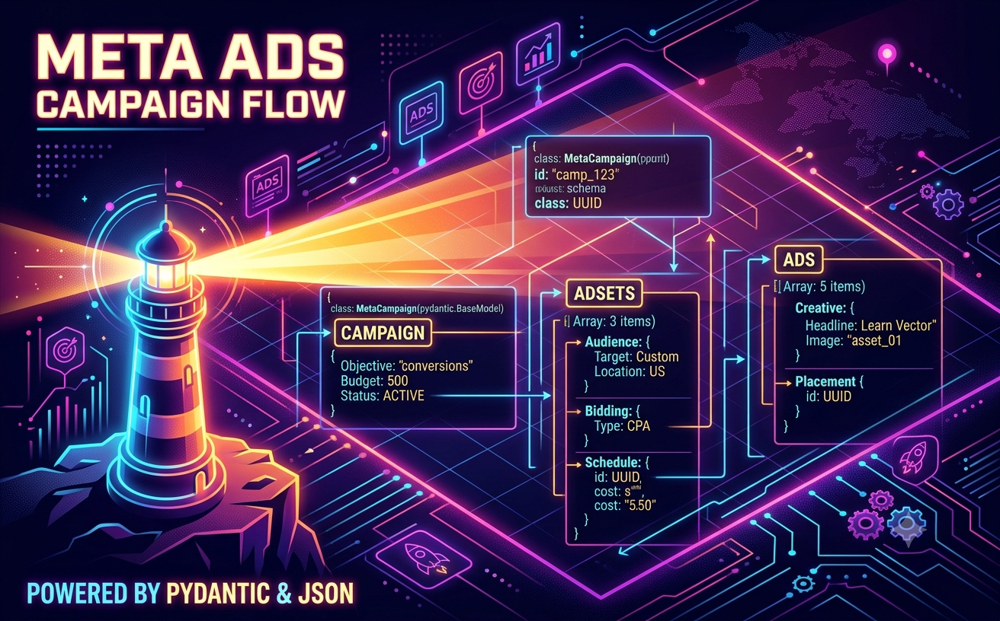

## El problema

En el [post anterior](./design-architecture.md) clasifiqué a `campaign_builder` como la más humilde de las cuatro tools: nada de loop agéntico, solo un structured output que deriva público, presupuesto y copy desde un brief. Por eso es la primera pieza que construyo — es la superficie más chica para probar el patrón de puertos antes de meterlo en tools con más partes móviles como `image_composer` o `landing_builder`.

Un creativo o una landing sin configuración de campaña no sirve de nada: alguien todavía tiene que decidir el objetivo, el público objetivo, el presupuesto diario, el placement y el copy del anuncio antes de poder publicar algo. Hacer eso a mano para cada brief de negocio es exactamente el tipo de trabajo repetitivo que un agente debería poder hacer. El objetivo de `campaign_builder_tool` es tomar un brief y devolver una configuración completa de Meta Ads —Campaign → AdSet → Ad— lista para revisar y publicar.

El problema no es que sea difícil pedirle eso a un LLM. El problema es conseguir que la respuesta sea un objeto de Python válido, con tipos correctos y restricciones de negocio cumplidas, sin parsear JSON a mano ni confiar en que el modelo "siempre devuelve lo correcto".

## La decisión antes de escribir el dominio: no acoplar el LLM al tool

Podría haber metido la llamada a OpenAI directo dentro del service de `campaign_builder`. Sería el camino más rápido para esta tool sola. Pero el diseño general ya deja claro que van a venir más tools que necesitan un LLM —`image_composer` para construir prompts, `landing_builder` para generar copy— y si acoplo el cliente HTTP, la autenticación y el manejo de errores a este tool, cada tool nueva termina duplicando esa infraestructura.

Por eso, antes de escribir una sola línea del dominio de `Campaign`, extraje esa parte a un módulo compartido: `src/shared/llm/`. Cualquier herramienta del proyecto —esta y las que siguen— puede depender de `LLMClientPort` sin saber qué proveedor hay del otro lado.

## La decisión clave: un puerto para LLMs

El principio ya estaba decidido a nivel de arquitectura: cada generador tiene que poder cambiar de proveedor sin tocar el dominio. Acá es donde lo aplico por primera vez en código, con los clientes de LLM.

El puerto define dos operaciones:

```python
class LLMClientPort(ABC):
    @abstractmethod
    async def complete(
        self,
        prompt: str,
        *,
        system: str | None = None,
        temperature: float = 0.7,
    ) -> str: ...

    @abstractmethod
    async def generate_structured(
        self,
        prompt: str,
        response_model: type[T],
        *,
        system: str | None = None,
        temperature: float = 0.4,
    ) -> T: ...
```

`complete()` es texto libre. `generate_structured()` es la operación interesante: recibe un modelo Pydantic como parámetro y devuelve una instancia validada de ese modelo. El llamante no tiene que saber nada de JSON Schema ni de parseo.

La fábrica que hace el cableado sigue el mismo patrón de factory-por-env-var que va a repetirse en cada tool generadora: una entrada por proveedor en un dict, elegida con una variable de entorno.

```python
_CLIENTS = {"openai": OpenAIClient, "anthropic": AnthropicClient}

def build_llm_client() -> LLMClientPort:
    provider = os.getenv("LLM_PROVIDER", "openai")
    client_class = _CLIENTS.get(provider)
    if client_class is None:
        raise ValueError(f"Unknown LLM_PROVIDER: {provider!r}")
    return client_class()
```

`AnthropicClient` es un stub por ahora —ambos métodos lanzan `NotImplementedError`— pero el patrón queda demostrado: agregar un proveedor real es implementar el puerto y registrarlo en el dict.

## `generate_structured`: el LLM como parser de schemas

La magia real está en cómo `OpenAIClient` implementa `generate_structured`. La API de OpenAI tiene un modo llamado `structured outputs` donde, en lugar de pedirle al modelo que "devuelva JSON", le pasamos el JSON Schema exacto de la respuesta esperada y el modelo se compromete a respetarlo.

Pydantic v2 puede derivar el JSON Schema de cualquier `BaseModel` con un solo método:

```python
schema = response_model.model_json_schema()
```

Ese schema va al request como `response_format`:

```python
json={
    "model": self._model,
    "messages": messages,
    "temperature": temperature,
    "response_format": {
        "type": "json_schema",
        "json_schema": {
            "name": model_name,
            "schema": schema,
            "strict": True,
        },
    },
}
```

La respuesta llega como JSON string en `choices[0].message.content`. Lo único que falta es validarlo contra el modelo:

```python
content = response.json()["choices"][0]["message"]["content"]
try:
    return response_model.model_validate_json(content)
except Exception as e:
    raise ValueError(f"Failed to parse {model_name} from LLM response: {e}") from e
```

Con `strict: True`, la API garantiza que el JSON se ajusta al schema. Con `model_validate_json`, Pydantic aplica las validaciones de negocio encima de eso —longitudes máximas, restricciones de valores, validators personalizados. Si algo falla, el error describe exactamente qué está mal.

## El dominio: modelar la jerarquía real de Meta Ads

La API de Facebook tiene una estructura de tres niveles: Campaign define el objetivo (awareness, leads, ventas); AdSet define el público, el presupuesto y el placement; Ad define el creativo y el copy. Modelar eso directamente en Pydantic tiene dos ventajas: el JSON Schema que se le pasa al LLM es exactamente la estructura que Meta espera, y los validators garantizan restricciones de negocio que Facebook rechazaría de todas formas.

Algunos ejemplos de validaciones en el dominio:

```python
class Targeting(BaseModel):
    countries: list[str] = Field(min_length=1)
    age_min: int
    age_max: int

    @model_validator(mode="after")
    def age_max_gte_age_min(self) -> Targeting:
        if self.age_max < self.age_min:
            raise ValueError(f"age_max ({self.age_max}) must be >= age_min ({self.age_min})")
        return self

class AdCreativeCopy(BaseModel):
    headline: str

    @field_validator("headline")
    @classmethod
    def headline_max_40(cls, v: str) -> str:
        if len(v) > 40:
            raise ValueError("headline must be ≤ 40 characters")
        return v
```

Si el LLM propone `age_min=45, age_max=25` o un headline de 50 caracteres, la validación falla antes de que el resultado llegue a la aplicación. El prompt le instruye al modelo que respete esas restricciones, pero el validator es la red de seguridad real.

Los enums también tienen peso aquí. Todos son `str` enums:

```python
class CampaignObjective(str, Enum):
    OUTCOME_AWARENESS = "OUTCOME_AWARENESS"
    OUTCOME_LEADS = "OUTCOME_LEADS"
    # ...
```

`str` enum significa que el valor serializa directamente al string que Meta espera. No hay una capa de traducción entre el modelo de dominio y la API de Facebook.

## El service: una llamada, un resultado

`CampaignBuilderService` es deliberadamente simple. Construye el prompt con el brief, llama a `generate_structured` con `Campaign` como modelo objetivo, y envuelve el resultado en `CampaignConfigResult`:

```python
async def build(self, brief: CampaignBrief) -> CampaignConfigResult:
    system, user = build_campaign_prompt(brief)
    try:
        campaign = await self._llm.generate_structured(user, Campaign, system=system)
        return CampaignConfigResult(
            brief=brief, campaign=campaign, status="success", errors=[]
        )
    except Exception as e:
        return CampaignConfigResult(
            brief=brief, campaign=None, status="failed", errors=[str(e)]
        )
```

El service nunca lanza excepción. Los fallos de red, los errores de validación del schema o los timeouts del LLM todos terminan en `errors` con `status="failed"`. El agente decide qué hacer con eso —reintentar, pedir más información al usuario, continuar con otro tool— sin que el service le dicte el comportamiento.

Es un patrón que pienso repetir en las próximas tools generadoras: no lanzar la excepción, convertirla en parte del resultado, y dejar que el agente decida. Acá, con una sola llamada al LLM, ni siquiera hace falta `asyncio.gather` — un try/except alcanza.

## El prompt como código de dominio

`build_campaign_prompt()` vive en el dominio, no en la aplicación ni en la infraestructura. La razón es que el prompt encarna conocimiento de negocio: qué valores son válidos para cada enum, qué restricciones de Facebook hay que respetar, qué estructura debe tener la respuesta.

El system prompt lista los valores permitidos de cada enum explícitamente. No confío en que el modelo los "sepa" de memoria:

```
- Pick CampaignObjective from: OUTCOME_AWARENESS, OUTCOME_TRAFFIC, OUTCOME_ENGAGEMENT,
  OUTCOME_LEADS, OUTCOME_APP_PROMOTION, OUTCOME_SALES.
- Pick CallToAction from: LEARN_MORE, SHOP_NOW, SIGN_UP, SUBSCRIBE, BOOK_TRAVEL,
  CONTACT_US, DOWNLOAD, GET_OFFER, GET_QUOTE.
```

El user prompt serializa solo los campos del brief que tienen valor. Si `country` es `None`, no se menciona el país y el modelo elige por contexto. Si viene `"MX"`, va explícito:

```python
lines = [
    f"Business: {brief.business_name}",
    f"Value proposition: {brief.value_proposition}",
    ...
]
if brief.country is not None:
    lines.append(f"Target country (ISO-2): {brief.country}")
```

El prompt hace estrategia; el schema hace validación. Los dos juntos eliminan la mayoría de los errores de salida del LLM.

## Qué cambió y qué aprendí

`campaign_builder_tool` ahora genera una configuración completa de campaña con una llamada. El resultado es un dict serializable con `model_dump(mode="json")` que incluye el brief original, el status, los errores (si hubo) y la campaña completa con AdSet y Ads.

Lo más valioso del proceso fue entender cuándo usar `generate_structured` versus `complete`. Texto libre está bien para razonamiento, resúmenes o respuestas abiertas. Cuando la salida tiene que encajar en una estructura de datos con tipos específicos y restricciones, `generate_structured` elimina toda la ingeniería de parseo y la reemplaza por un contrato explícito entre el modelo y el código.

La otra lección es que el JSON Schema que Pydantic genera automáticamente es exactamente lo que el LLM necesita para entender la estructura esperada. No hace falta describirla dos veces —una en el prompt y otra en el código. El modelo ve el schema, el código valida contra el mismo schema. Un solo punto de verdad.

Lo que viene después es la publicación: un `FacebookPublisherPort` que tome el `Campaign` generado aquí y lo envíe a la Graph API. El diseño ya lo permite sin tocar nada del dominio ni del service.

## Una pregunta que no tengo resuelta: cómo pruebo esto a mano

Escribiendo este post me di cuenta de algo que se me había pasado por alto: no tengo un mecanismo fácil para probar `campaign_builder_tool` manualmente. Tengo tests unitarios sobre el service y el dominio, pero eso no es lo mismo que poder mandarle un brief real y ver qué devuelve el LLM en la práctica — probar el prompt, ver si el modelo respeta los enums, revisar si `strict: True` realmente sostiene su promesa con casos raros.

Las dos opciones obvias que se me ocurren:

1. Levantar una API mínima solo para pruebas, y pegarle con algún cliente (curl, Postman, lo que sea).
2. Escribir scripts de Python sueltos que instancien el service directo y lo corran contra el LLM real.

Todavía no sé cuál conviene más para este proyecto, ni si hay una tercera opción que no estoy viendo.

Lo que sí tengo claro es que para estas pruebas quiero aprovechar modelos open source corriendo localmente, en vez de gastar cuota contra la API de OpenAI cada vez que quiero probar algo. La opción que conozco para eso es Ollama, así que supongo que voy a usar esa.
