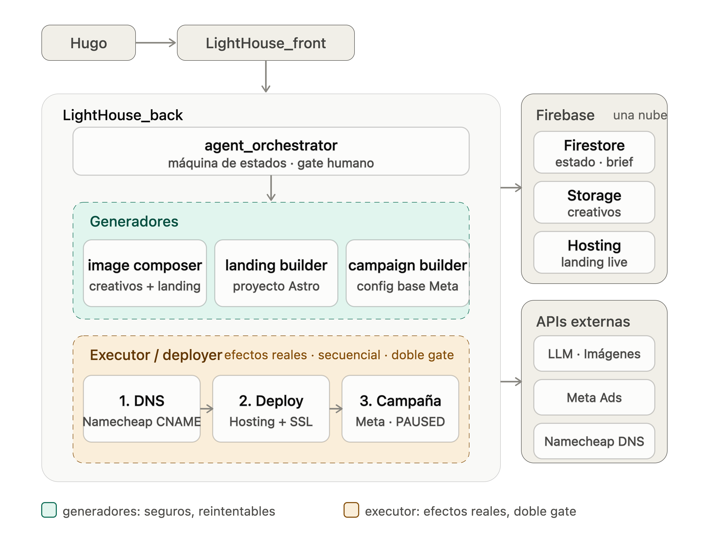

En el post anterior escribí la idea y las razones para construirla. Ahora toca aterrizar cómo se va a construir en serio. Tenía un HLD escrito y un diagrama de cajitas en un bloc de notas, pero entre tenerlo en papel y tener algo coherente que pueda empezar a codear hay una distancia. Este post es esa distancia.
 
## El diagrama con el que arranqué
 
Mi punto de partida era este esquema mental: un frontend de chat, un backend con cuatro "tools" y dos almacenamientos. Las tools eran `image_composer`, `landing_builder`, `campaign_builder` y `deployer`. El almacenamiento eran Firebase para el estado del proyecto y AWS S3 para recursos estáticos.
 
Funciona como boceto. Pero en cuanto empecé a cuestionarlo en serio aparecieron tres problemas que valía la pena resolver antes de escribir una sola línea de código.
 
## Problema 1: AWS S3 sobraba
 
S3 apareció en el diagrama por inercia: cuando validé la idea manualmente monté la infraestructura en AWS, así que ya estaba en mi cabeza. Pero mirándolo sin ese contexto, meter AWS junto a Firebase me obliga a mantener dos nubes. Dos juegos de credenciales, dos SDKs, dos consolas, dos facturas. Para una herramienta cuyo objetivo es que me pueda olvidar de ella, eso es exactamente lo que no quiero.
 
La decisión fue fácil: **Firebase Storage para todo**. Ya voy all-in en Firebase (Hosting + Firestore), así que Storage no agrega un proveedor nuevo ni un concepto nuevo. De paso, también aclaré qué demonios vive en ese storage, porque eso era la parte que seguía vaga:
 
- **Creativos generados** (imagen base + composición con titular y CTA): necesitan URL pública porque los muestra la galería de revisión y luego los consume Meta para los anuncios. Esto es lo que de verdad vive en Storage.
- **Imágenes de la landing**: estas van horneadas dentro del build de Astro, en la carpeta `public/`, antes de compilar. La landing se despliega autocontenida en Hosting y no depende de Storage en runtime.
- **El build compilado** (opcional): guardar el artefacto versionado me deja re-desplegar o hacer rollback sin recompilar.
Todo lo demás —brief, config de campaña, historial de chat, métricas, estado de fase— es estado, no recurso estático. Va a Firestore, nunca a Storage. Con eso, "recursos estáticos" quedó definido de forma estrecha y concreta.
 
## Problema 2: el `deployer` no es una tool más
 
En mi boceto original las cuatro tools estaban dentro de la misma caja, como si fueran pares. Pero hay una línea que el diseño tiene que reflejar: los primeros tres son **generadores** y el cuarto es un **ejecutor**.
 
`image_composer`, `landing_builder` y `campaign_builder` producen artefactos. No tocan el mundo real, son idempotentes, se pueden correr en paralelo y reintentar sin consecuencias.
 
`deployer` tiene efectos reales e irreversibles: crea un registro DNS, despliega una landing pública, lanza gasto publicitario de verdad. Tiene que ser secuencial con dependencias estrictas (DNS primero, deploy después, campaña al final), necesita compensación si un paso falla, y es donde vive la regla de oro y el doble gate.
 
Ponerlos en la misma caja aplana la distinción más importante del sistema. En el diagrama que quedó, los generadores tienen su propia zona (seguros, reintentables, paralelos) y el deployer está aparte con sus tres pasos explícitos. No es cosmética: es dónde está todo el riesgo financiero concentrado, y el diseño tiene que recordarme tratarlo distinto.
 
## Problema 3: ¿son subagentes las tools, o no?
 
Esta fue la pregunta más interesante. Vi que las cuatro tools necesitaban "tomar decisiones propias" y me pregunté si deberían ser subagentes. La respuesta es que estaba juntando dos preguntas distintas.
 
**Primera pregunta: ¿cuánta autonomía necesita cada tool?**
 
"Subagente" no es gratis. Cada uno agrega latencia, costo (más llamadas al LLM), no-determinismo y superficie de debugging. La regla que adopté es darle a cada tool la *mínima* autonomía que resuelve su trabajo. Mirándolas así, no están al mismo nivel:
 
- **`landing_builder`** sí gana con ser un subagente. Generar una landing decente es un loop real: estructura → copy → código → correr el build → si falla, leer el error y corregir → reintentar. Ese "leer error y corregir" es razonamiento con herramientas. Es genuinamente agéntico.
- **`image_composer`** está a la mitad. La parte con criterio es construir buenos prompts desde el brief (una o dos llamadas al LLM). Generar la imagen y componer el overlay con Pillow es código determinista. Subagente ligero, solo si quiero que se autocritique y regenere.
- **`campaign_builder`** es más humilde de lo que parece. Derivar público, presupuesto y copy desde el brief es básicamente un structured output: un paso de LLM que devuelve JSON validado con Pydantic. Meterle un loop agéntico sería sobre-ingeniería.
- **`deployer`** necesita la *menor* autonomía posible, no la mayor. Es exactamente la zona de efectos reales. No quiero un LLM decidiendo libremente crear registros DNS o activar gasto. Sus "decisiones" (¿respondió 200? ¿está el SSL? ¿reintento o fallo?) son control de flujo determinista, no razonamiento. Lo mantengo lo más tonto posible: es mi seguro contra gastar sin darme cuenta.
**Segunda pregunta: ¿repos separados?**
 
También me pregunté si cada subagente debería vivir en su propio repo. La respuesta corta es no.
 
Si los subagentes se importan como librerías al mismo proceso de FastAPI, no se despliegan de forma independiente: corren in-process. Separar repos solo me compraría organización de código, no aislamiento en runtime. Y esa organización la consigo igual con **fronteras de módulos dentro de un solo repo**: un paquete por subagente (`agents/landing_builder/`, `agents/image_composer/`, etc.), cada uno con su interfaz clara y sus tests. Contratos limpios sin el impuesto de repos separados: versionado cruzado, pinning, CI por repo, y el dolor de que un cambio que toca dos componentes se vuelvan dos PRs.
 
Para un usuario con 1-2 proyectos al mes, ese impuesto no compra nada. Y si algún día un subagente necesita ser su propio deployable, una frontera de módulo limpia hace que extraerlo sea trivial. Empiezo simple y me dejo la puerta abierta.
 
## Cómo quedó el diagrama
 
Con todo eso resuelto, el diagrama de contenedores quedó así:
 

 
Una sola nube, dos zonas claramente separadas dentro del backend, y cada tool con la autonomía justa para su trabajo.
 
## Lo que sigue
 
El diagrama de contenedores está. Los siguientes pasos son definir los contratos de cada subagente (qué recibe, qué devuelve, cuál es su política de efectos) y el modelo de estado en Firestore: cómo se ven los documentos del proyecto y la máquina de fases. Una vez fijados los contratos, puedo construir cada componente por dentro sin miedo a romper el resto.