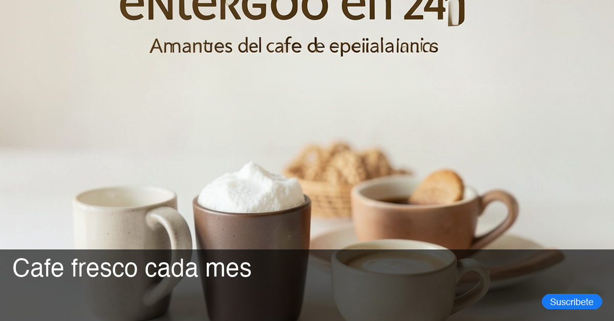

## El problema de fondo

En el [post anterior](./campaign-builder-generate-structured.md) construí `campaign_builder_tool` y con eso quedó en pie la estructura DDD del proyecto: puertos abstractos, una fábrica que elige el proveedor por variable de entorno, y un service que nunca lanza excepción sino que devuelve un `status`. `LLMClientPort` fue la primera aplicación de ese patrón.

`image_builder_tool` es la segunda. La pregunta ya no es "¿uso puertos?" —esa decisión quedó tomada— sino qué puertos necesita un dominio distinto: generar imágenes para los anuncios de Facebook. No una imagen: varias variantes en paralelo, cada una con un mood distinto, con el headline y el CTA superpuestos encima, subidas a Firebase y listas para Meta Ads.

Eso son al menos cuatro responsabilidades encadenadas: generar, componer, subir al storage, y devolver un resultado coherente aunque alguna imagen falle a mitad del proceso. Y a diferencia de `campaign_builder`, acá la generación es paralela desde el primer día —tres o más llamadas al proveedor de imágenes a la vez—, así que el manejo de fallos parciales no es opcional.

## Tres puertos nuevos, mismo molde que `LLMClientPort`

Si ya leíste el post anterior, la forma de esto te va a resultar familiar: una interfaz abstracta por responsabilidad, el service solo habla con la interfaz, y una fábrica hace el cableado real fuera del dominio.

```python
class ImageGeneratorPort(ABC):
    @abstractmethod
    async def generate(self, prompt: str, width: int, height: int) -> GeneratedImage: ...

class ImageComposerPort(ABC):
    @abstractmethod
    def compose(self, image: GeneratedImage, brief: ImageBrief) -> bytes: ...

class ImageStoragePort(ABC):
    @abstractmethod
    async def upload(self, image_bytes: bytes, filename: str, project_id: str) -> str: ...
```

`ImageBuilderService` nunca importa un SDK de generación de imágenes, Pillow ni Firebase directamente. En los tests inyecto stubs en lugar de llamadas reales a la API; en producción cambio el generador con una entrada en un dict.

La fábrica que hace el cableado vive en la capa de tool, fuera del dominio —el mismo lugar donde vive `build_llm_client()`:

```python
_GENERATORS = {
    "dalle3": DalleImageGenerator,
    "vertex": VertexImageGenerator,
}

def _build_service() -> ImageBuilderService:
    provider = os.getenv("IMAGE_PROVIDER", "dalle3")
    generator = _GENERATORS[provider]()
    return ImageBuilderService(generator, PillowImageComposer(), FirebaseStorageAdapter())
```

Hoy ese dict tiene dos entradas concretas porque son las que uso para probar que el mecanismo funciona, pero todavía no decidí cuál va a ser el proveedor definitivo de generación de imágenes — es bastante probable que ese código cambie o desaparezca antes de llegar a producción. Lo que sí es definitivo es el puerto: agregar o quitar un proveedor es tocar una entrada en un dict, y el resto del sistema ni se entera —y esto va a importar más abajo, cuando meta un proveedor local con Ollama solo para pruebas.

## Fallos parciales con `asyncio.gather`

Esto sí es nuevo respecto a `campaign_builder`: ahí una sola llamada al LLM bastaba, así que un `try/except` resolvía todo. Acá genero 3 imágenes en paralelo, y si una falla, la respuesta obvia —lanzar excepción y abortar— es la peor para este caso. Si el creativo 1 y el 3 salieron bien, tirarlos a la basura porque el 2 tuvo un rate limit es un desperdicio.

`asyncio.gather` tiene un parámetro para esto:

```python
results = await asyncio.gather(
    *[self._generator.generate(p, 1200, 628) for p in prompts],
    return_exceptions=True,
)
```

Con `return_exceptions=True`, las excepciones no se propagan: se devuelven como valores en la lista de resultados. El service los clasifica uno por uno:

```python
for i, result in enumerate(results):
    if isinstance(result, Exception):
        errors.append(f"Variant {i}: {result}")
        continue
    # procesar el resultado exitoso...
```

El `ImageBuildResult` final tiene un campo `status` que refleja qué pasó, con la misma forma que `CampaignConfigResult` en el post anterior:

```python
if len(creatives) == brief.n_images:
    status = "success"
elif len(creatives) > 0:
    status = "partial"
else:
    status = "failed"
```

Un job que entrega 2 de 3 creativos no aborta la campaña. Devuelve `"partial"` y el agente decide qué hacer con eso.

## Por qué pruebo con `httpx`, no con el SDK del proveedor

Todavía no elegí qué proveedor de generación de imágenes se queda en producción, así que no quiero que mis tests dependan de las particularidades de un SDK que puede desaparecer del proyecto en cualquier momento. Los SDKs oficiales suelen ser convenientes pero opacos para testear. `httpx` me da control total sobre los requests, y `pytest-httpx` permite mockear el servidor HTTP completo sin parchear internals de ningún cliente:

```python
async def test_generate_returns_generated_image(monkeypatch, httpx_mock: HTTPXMock):
    httpx_mock.add_response(
        method="POST",
        url="https://api.openai.com/v1/images/generations",
        json={"data": [{"url": image_url}]},
    )
    httpx_mock.add_response(method="GET", url=image_url, content=FAKE_PNG)

    result = await DalleImageGenerator().generate("A background", 1200, 628)
    assert result.image_bytes == FAKE_PNG
```

El ejemplo usa el adapter que hoy tengo de prueba (`DalleImageGenerator`), pero el punto es genérico: el test intercepta las llamadas HTTP sin levantar ningún server. El día que decida el proveedor final —o lo cambie de nuevo— este approach de testeo no se rompe, porque prueba el comportamiento HTTP, no los internals de un SDK específico.

## La composición en Pillow: tres pasos

`PillowImageComposer` toma los bytes de la imagen generada y le superpone el texto. El pipeline es:

1. **Center-crop a 1200×628.** Ningún proveedor de generación de imágenes entrega exactamente el aspect ratio de Facebook —el que estoy probando hoy devuelve `1792×1024`, el más cercano a 16:9 que permite—. Sea cual sea el proveedor final, Pillow escala y recorta al centro para llegar exactamente al tamaño que necesito.
2. **Barra semitransparente.** Un rectángulo negro con alpha 160 en los 140px inferiores. Suficiente contraste para leer texto sobre cualquier fondo sin tapar la imagen.
3. **Headline + pill del CTA.** El headline va en blanco sobre la barra. El CTA es un rectángulo redondeado en azul Facebook (`#1877F2`) anclado al corner inferior derecho.

Todo en una imagen `RGBA` hasta el final, donde se convierte a `RGB` para el PNG final. Esto garantiza que la composición de capas funcione correctamente.

## El flujo completo como herramienta de LangGraph

El punto de entrada es un `@tool` que recibe un dict, lo valida como `ImageBrief` (Pydantic v2), llama al service y devuelve el resultado serializado:

```python
@tool
async def image_builder_tool(brief_dict: dict) -> dict:
    """
    Generates ad creative images for a business validation campaign.
    Input: serialized ImageBrief dict.
    Output: serialized ImageBuildResult dict.
    """
    brief = ImageBrief.model_validate(brief_dict)
    service = _build_service()
    result = await service.build(brief)
    return result.model_dump()
```

Si el brief tiene el headline con más de 40 caracteres o el CTA con más de 20, Pydantic lanza `ValidationError` antes de que el service arranque. El agente lo recibe como error y puede pedirle al usuario que corrija el input sin gastar ni una llamada al proveedor de generación de turno.

## Primeras pruebas con Ollama: resultados con `x/flux2-klein:4b`

En el post anterior cerré diciendo que quería probar los tools contra modelos open source corriendo en local con Ollama, en vez de quemar cuota de un proveedor cloud cada vez que quería ver un resultado. `image_builder_tool` fue el primer lugar donde lo intenté en serio. Gracias al puerto, sumar el proveedor local fue una entrada nueva en el dict de la fábrica y un adapter que le habla a la API de Ollama en vez de a DALL-E o Vertex — ni una línea de `ImageBuilderService` cambió.

Los resultados de correr el mismo brief contra `x/flux2-klein:4b` cuentan una historia mixta.

Cuando el prompt es relativamente simple, el modelo entrega algo defendible. La composición de Pillow encima —barra semitransparente, headline, CTA— se ve igual de bien:


El problema aparece con una instrucción específica del prompt: no generar texto dentro de la imagen, porque el headline y el CTA ya los pone Pillow encima. El modelo la ignora de forma sistemática, y cuando genera texto, el resultado es ilegible:




No es un resultado para mostrarle a un cliente. Pero como primera corrida sirve para dos cosas: confirma que el puerto realmente aísla al service del proveedor, y me da una base concreta —estas mismas imágenes— desde la cual iterar el prompt y probar modelos locales más grandes sin pagar por cada intento.

## Qué aprendí

Sobre Ollama: los resultados de `x/flux2-klein:4b` no son buenos, pero tampoco esperaba que lo fueran. Lo que quería validar era el mecanismo —swap de proveedor sin fricción— y eso funcionó de punta a punta. La calidad de la imagen es un problema de otro día: cuestión de probar modelos más grandes o ajustar el prompt.

Lo que sí me sorprendió fue el rendimiento. No esperaba que mi computadora aguantara generar 3 imágenes en paralelo sin arrodillarse, y aguantó. No cambia nada para producción, pero me deja pensando en montar un VPS con un modelo open source más potente el día que quiera dejar de depender de un proveedor cloud para esto.

Es algo que había leído en varios lados sin terminar de entenderlo del todo: para quien no puede pagar las suscripciones de los proveedores grandes, montar un modelo open source en infraestructura propia deja de ser una curiosidad y se vuelve una alternativa real. Después de esta prueba, lo entiendo mejor.

El otro aprendizaje es sobre `asyncio.gather(return_exceptions=True)`. Antes lo conocía como una firma en la documentación. Ahora tengo un service entero diseñado alrededor de esa semántica y el `status: "partial"` que representa es una primera clase en el modelo de dominio, no un caso de error.

Lo que viene después es la capa de revisión del agente: ver las imágenes generadas antes de aprobar la campaña. Para eso necesito que `image_builder_tool` devuelva URLs ya subidas a Firebase, que es exactamente lo que ya hace.
