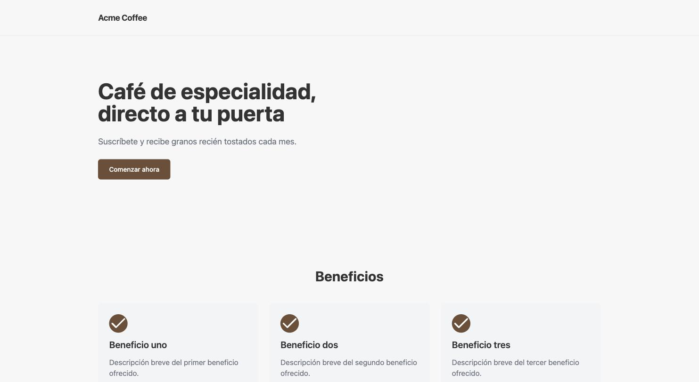
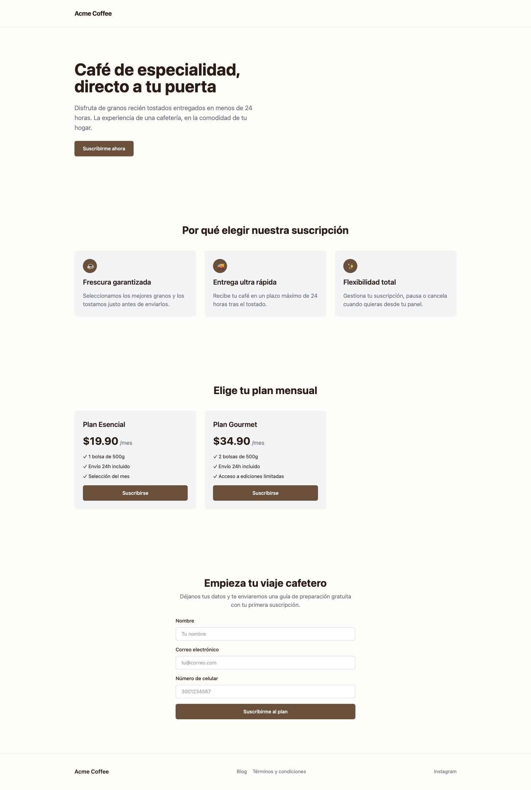
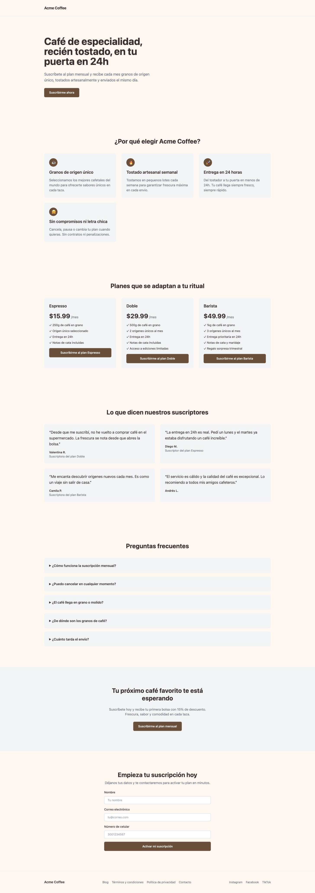
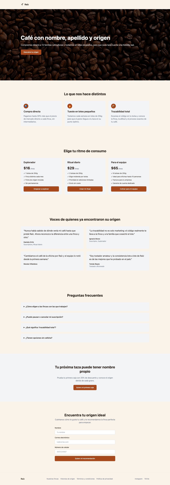

## El problema

Las dos tools que ya existen —`image_builder` y `campaign_builder`— generan creativos y configuración de campaña. Falta la pieza que cierra el ciclo de validación: una landing page real donde mandar el tráfico de esos anuncios.

La idea es simple de decir y compleja de resolver: el usuario da un brief de negocio, un LLM genera el contenido y la estructura de una landing, y el frontend puede previsualizarla como un sitio real (no un mockup) antes de que nadie la publique.

Eso trae tres problemas nuevos que las tools anteriores no tenían: de dónde sale el código de la landing, cómo se genera un preview navegable, y cómo se versiona el resultado sin que el repo se llene de landings que nadie va a volver a tocar.

## Empecemos a responder

Voy a resolver esto en el mismo orden en que fueron apareciendo como problema — y no es casualidad, es también el orden de importancia de la decisión. Qué construye el LLM condiciona casi todo lo demás. El preview es la siguiente pieza más importante: es lo que el usuario ve y aprueba antes de que nada se persista. El versionado con GitHub, en comparación, es la decisión menos importante de las tres — un detalle de infraestructura que solo tiene que evitar acumular basura, no resolver nada más sofisticado que eso.

### ¿De donde sale el código de la landing page?

La primer opción que cruzó por mi mente fue construir la landing enteramente desde cero, delegando el proceso completo de escritura de código y diseño al agente. Ya había hecho una prueba [(puedes ver la aquí)](https://altitud2800.loumitos.com/) y honestamente quede sorprendido por lo rapido y el buen resultado que obtuve. Sin embargo, descarté rápido la opción. Aunque el resultado seguramente seria igual de bueno en todas las ejecuciones, un LLM escribiendo código arbitrario quiza no seria la mejor opción para un proyecto que busca validar ideas rapido y barato.

¿Y si pudiera darle piezas ya armadas al agente?
Cree una [**librería fija de secciones**](https://github.com/HugoTalledos/lighthouse_landing_template) que vive en un template de Astro (un repo de GitHub aparte, público, que no es parte de este backend). El LLM nunca toca ese repo base — solo decide qué secciones usar y con qué contenido.

Esto es el mismo patrón que ya usé en `campaign_builder`: en vez de pedirle texto libre al LLM, le pido una estructura de datos validada con `generate_structured`. Ahí el "esquema" era `Campaign`; acá es `PageComposition`:

```python
class PageComposition(BaseModel):
    theme: Theme
    sections: list[Section]  # unión discriminada por "type": hero, features,
                              # testimonials, pricing, faq, cta, footer
```

Cada `type` corresponde 1:1 a un componente del template (`Hero.astro`, `Features.astro`, etc). El LLM nunca ve ni escribe Astro — solo llena esta estructura, y un renderer determinista se encarga de convertirla en el archivo que el template espera.

Para esto, la librería cuenta con 2 archivos importantes:
- **`PAGE_JSON.md`**: referencia en prosa de la forma de `page.json` — qué campos existen, cuáles son obligatorios, a qué componente mapea cada uno, y qué pasa si un valor es inválido (rompe el build) o se omite (cae a un fallback). Está escrito para que el LLM entienda el *por qué* de cada campo antes de llenarlo, no solo el tipo de dato.
- **`page.schema.json`**: el mismo contrato pero como JSON Schema, para validar estructuralmente la salida del LLM antes de que llegue al renderer.

La ventaja concreta de este enfoque frente a dejar que el LLM escriba código libremente es que el proceso se vuelve más determinista. El LLM decide qué contenido usar y cómo componerlo dentro de las secciones disponibles, pero la apariencia final —estilos, layout, sistema de diseño— la sigo controlando yo desde el template, no algo que el modelo reinventa en cada corrida.

La extensión natural de esta idea es un monorepo con varias plantillas — distintos estilos, distintos "vibes" visuales — donde el LLM no solo decide qué contenido va en cada sección, sino cuál plantilla completa se ajusta mejor al caso de uso del brief. Todavía no lo construí, pero el patrón `PageComposition` + renderer determinista se sostiene igual con una plantilla que con diez.

Una duda que todavía no resolví: sospecho que `PAGE_JSON.md`, lejos de ayudar al modelo a decidir mejor, solo le suma tokens de contexto sin una mejora proporcional en la composición que genera. No lo he medido — falta la prueba de comparar la salida con y sin ese archivo en el contexto antes de asumir que vale lo que cuesta.

### Preview antes de persistir

`image_builder` ya había resuelto un problema parecido con creativos: subir directo a storage permanente deja huérfanos cuando el usuario rechaza una variante. La solución ahí fue subir primero a un prefijo `staging/` con TTL, y mover a `creatives/` solo cuando el usuario aprueba (`promote_creatives_tool`).

Para `landing_builder` copié la misma forma —generar, previsualizar, aprobar, recién ahí persistir— pero encontré una simplificación: el preview de una landing no necesita un `staging/` propio, porque **Firebase Hosting ya tiene su propio mecanismo de preview con expiración incorporada** (los "preview channels"). No hace falta reinventar el TTL para el preview.

```
landing_builder_tool(brief)
  → LLM compone → render → astro build → deploy a preview channel (TTL nativo)
  → devuelve { composition, preview_url }   ← nada se persiste

promote_landing_tool(project_id, composition)
  → re-descarga template → re-renderiza la misma composition → tar → sube a Storage
```

Lo interesante de `promote_landing_tool` es que no necesita el directorio temporal donde se hizo el build original — porque el renderer es una función pura:

```python
def render(composition: PageComposition, project_dir: str) -> None:
    path = os.path.join(project_dir, "src", "data", "page.json")
    with open(path, "w") as f:
        f.write(composition.model_dump_json())
```

Misma `composition` de entrada, mismo `page.json` de salida, siempre. Eso significa que `promote_landing_tool` puede volver a descargar el template desde cero y re-renderizar, en vez de necesitar que sobreviva un directorio temporal entre dos llamadas de tool separadas. Cada tool se queda stateless, que es justo la forma en que las demás tools de este proyecto ya están diseñadas.

### Versionar sin GitHub

Esta es la decisión de menor prioridad de las tres, pero fue donde más tiempo pasé pensando, porque las opciones obvias tienen problemas obvios.

**Un repo de GitHub por landing** (usando la función de "template repository" de GitHub) da versionado real, pero cada landing abandonada es un repo que se queda ahí para siempre. GitHub no tiene un mecanismo nativo de TTL para(al menos no que yo sepa)— habría que armar un cron aparte solo para eso.

**Un solo repo con una rama por landing** evita la multiplicación de repos, pero cambia el problema de lugar: ahora es un repo que crece sin límite, con cientos de ramas huérfanas.

**Un git bundle por landing guardado en Storage** (un solo archivo binario con todo el historial de git, sobrescrito en cada commit) resuelve ambos: no crea repos nuevos, y como es un solo objeto por landing, sí se le puede poner un lifecycle rule de borrado. Es una idea elegante, pero es infraestructura nueva — hay que extraer bundles, rehidratar repos temporales, manejar la mecánica de git donde antes no había ninguna.

Lo que destrabó la decisión fue una pregunta simple: ¿las landing pages cambian mucho después de que el usuario las aprueba? La respuesta, dado que son artefactos de validación de una idea, es no. Van a tener un puñado de iteraciones mientras se ajusta el contenido, y después quedan quietas hasta que se abandonan.

Si los cambios son raros, no hace falta que el versionado sea eficiente en diffs — el git bundle resuelve un problema que no tengo. Lo que sí necesito es simplicidad y limpieza automática. Eso es exactamente lo que da guardar snapshots simples:

```python
async def save_snapshot(self, project_id: str, version: str, project_dir: str) -> str:
    # tar.gz del árbol de archivos (sin node_modules/.git/dist)
    # sube a landings/{project_id}/{version}/source.tar.gz
    ...
```

Git solo se usa una vez, de forma efímera, para descargar el template al generar la landing. Nunca se vuelve a versionar con git — la "versión" es literalmente una carpeta con timestamp en Storage.

## Resultados con distintos modelos

Con las tools y el template listos, las primeras corridas las hice con modelos locales. El resultado me dejó la misma sensación de "pereza" que ya había visto en otras tools del proyecto: el contenido generado se parecía demasiado a los ejemplos que le pasaba en el prompt, a veces calcando frases casi textuales en vez de adaptarlas al brief.

No sabía si era una limitación real del LLM o falta de potencia del modelo local, así que compré algunos créditos de OpenRouter para probar con modelos más grandes. La mejora fue real pero acotada: los textos salieron mejor redactados y con menos calco literal de los ejemplos, pero no hubo un salto de calidad significativo en las decisiones de composición — qué secciones usar, cómo estructurarlas.

Para que la comparación sea justa, los cuatro resultados de abajo salen del mismo brief de entrada — mismo negocio, mismo público, mismo tono — variando solo el modelo que arma el `PageComposition`:

```json
{
  "project_id": "proj-mock-1",
  "business_name": "Acme Coffee",
  "value_proposition": "Cafe de especialidad entregado en 24h",
  "target_customer": "Amantes del cafe de especialidad, 25-45 anios",
  "product_or_service": "Suscripcion mensual de cafe en grano",
  "tone_hint": "calido",
  "primary_cta_goal": "Suscribirse al plan mensual",
  "brand_color_hint": "#6F4E37"
}
```


*Landing generada con Llama 3.2 corriendo en local vía Ollama*


*Landing generada con Gemini 3.1*


*Landing generada con Qwen 3.7*


*Landing generada con Sonnet 5*

Con eso, mi hipótesis por ahora es que el techo actual no es tanto el modelo sino el template: es deliberadamente básico —pocas secciones, poca variación visual— así que no le da al LLM mucho margen para tomar decisiones de diseño interesantes aunque quisiera. Antes de seguir gastando en modelos más caros, el próximo experimento tiene más sentido del lado del template —más variantes por sección, más plantillas completas, la idea del monorepo de arriba— que del lado del LLM.
_(Aunque siendo honestos, le estoy pidiendo milagros a los modelos, el brief de prueba es muy pobre)._

## Siguiente paso: imágenes reales

Ahí aparece un siguiente paso obvio, y en la misma línea de "el template es básico": hoy el llm tiene que poner un url para las imagenes de la landing, por obvias razones, siempre me devuelve null esa información. Pero ya existe `image_builder`, la tool que genera los creativos de Facebook para la misma campaña. Hay dos formas de conectarlos:

- **Reusar los creativos ya generados**: si para el mismo brief ya hay imágenes de campaña aprobadas, `landing_builder` podría tomarlas directo y ponerlas en el hero/features — la landing hereda la identidad visual de los anuncios que la van a traer, en vez de mostrar algo desconectado.
- **Generar imágenes propias para la landing**: los creativos de `image_builder` están pensados para el formato/tamaño de un ad de Facebook, no para una sección hero de ancho completo. La alternativa es que `landing_builder_tool` dispare su propia generación de imágenes usando `image_builder` como dependencia interna, pidiendo el formato que cada sección realmente necesita.

Los dos resuelven el mismo síntoma —el template se siente vacío sin contenido visual real— pero con trade-offs distintos: reusar es gratis (nada nuevo que generar) pero acopla la landing a que ya exista una campaña con creativos aprobados para ese mismo brief; generar es más flexible pero duplica costo y le suma una dependencia nueva a `landing_builder_tool`. Todavía no decidí cuál, pero es la extensión más concreta antes de seguir invirtiendo en más plantillas.
